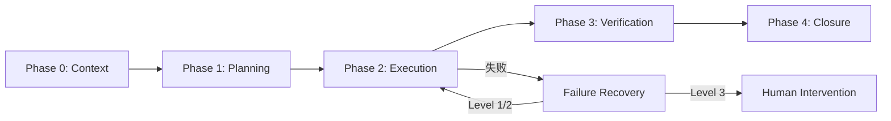

# Task Flow — 任务编排流程

> 本文件定义 Harness 核心编排流程。所有配置值引用 `harness-config.yaml`，不硬编码。

## 流程概览



---

## Phase 0: Context Loading

1. 加载项目入口指令（CLAUDE.md / AGENTS.md）
2. 加载 Harness 规则（`.harness/` 编排文件 + 平台 rules）
3. 检查 `progress.md` 是否有未完成的计划
4. 如有 Team Memory，执行 `memory_context` 获取相关经验
5. 评估当前 context 预算

> 执行本阶段后，检查 `extensions/after-phase-0.md`，若存在则执行其中指令。

---

## Phase 1: Planning

1. 理解需求，生成或加载 Plan
2. **签署 Plan Contract**（参考 `contracts/plan-contract.md`）
   - 明确交付物、完成标准、scope 边界
   - 评估 context 消耗（S/M/L）
3. 判断是否需要拆分（参考 `context-management.md`）
   - 涉及文件 > `context.split_file_threshold` → 建议拆分
   - 包含独立子任务 → wave-based 并行
4. 写入 `progress.md` 初始状态
5. 若 scope 超出预期 → 人工确认

> 执行本阶段后，检查 `extensions/after-phase-1.md`，若存在则执行其中指令。

---

## Phase 2: Execution

1. 按任务顺序（或 wave 并行）逐步执行
2. 每个任务开始前**签署 Task Contract**（参考 `contracts/task-contract.md`）
3. 执行任务，Hook 自动检查（lint-on-edit, 安全防护）
4. 每个任务完成后更新 `progress.md`
5. 持续监控 context 使用率（参考 `context-management.md`）
   - WARNING (> `context.warning_threshold`) → 准备保存状态
   - CRITICAL (> `context.critical_threshold`) → 完成当前步骤后停止
6. 遇到失败 → 应用失败分类策略（参考 `../failure/failure-taxonomy.md`）

### Wave 并行模式

当 Plan 包含独立子任务时：

```
Wave 1（并行）：无依赖的子任务同时执行
Wave 2（串行）：依赖 Wave 1 产出的任务
Wave N：依次类推
```

每个 wave 内的子任务可用独立 subagent 执行（fresh context window）。

> 执行本阶段后，检查 `extensions/after-phase-2.md`，若存在则执行其中指令。

---

## Phase 3: Verification

1. 运行 `harness-config.yaml` 中定义的质量门禁
2. 对照 Plan Contract 完成标准逐项验证
3. 若验证失败 → 回到 Phase 2 修复（计入失败次数）

> 执行本阶段后，检查 `extensions/after-phase-3.md`，若存在则执行其中指令。

---

## Phase 4: Closure

1. 更新 `progress.md` 状态为 `done`
2. 若配置 `plans.archive_completed: true` → 归档到 `plans/completed/`
3. 如有 Team Memory，执行 `memory_save` 沉淀经验
4. 总结本次执行的关键决策和学习

> 执行本阶段后，检查 `extensions/after-phase-4.md`，若存在则执行其中指令。

---

## 扩展机制

在 `extensions/` 目录放置 `after-phase-{N}.md` 文件即可在对应 Phase 后执行额外步骤。

| 操作类型 | 可靠性 | 说明 |
|----------|--------|------|
| 新增步骤（additive） | ✅ 高 | 在 `extensions/` 放新文件即可 |
| 覆盖步骤（override） | ⚠️ 中 | 可能与原始指令冲突 |
| 条件分支 | ❌ 低 | 应放 `harness-config.yaml` 用配置控制 |

详见 `extensions/README.md`。
