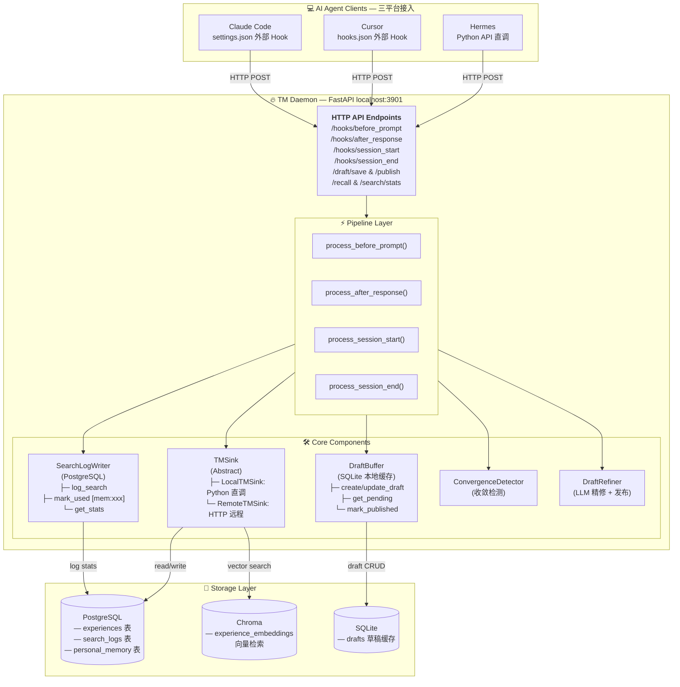
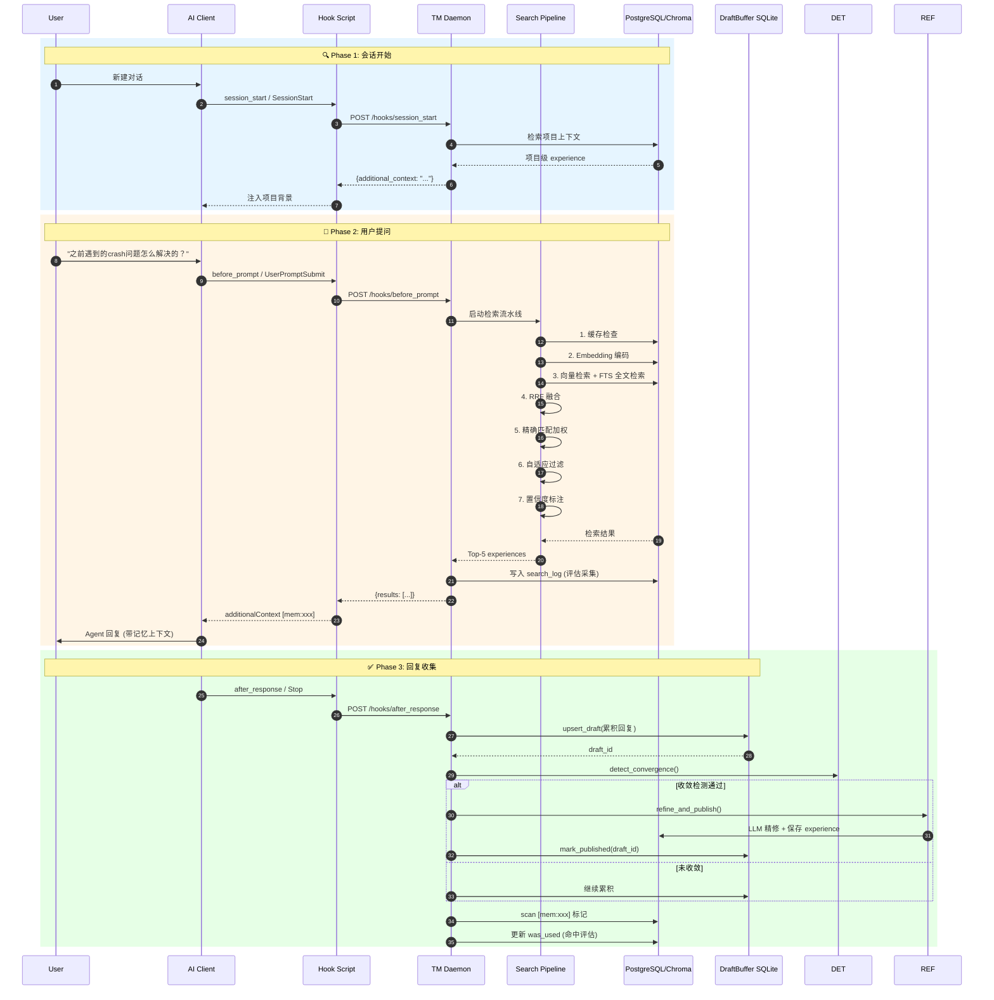
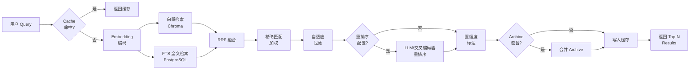
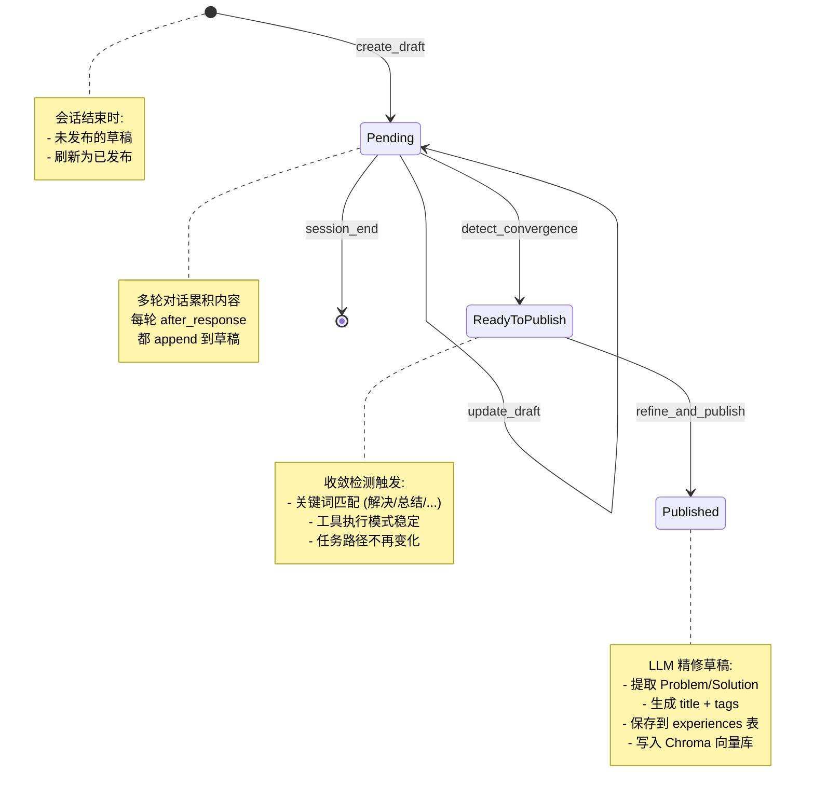
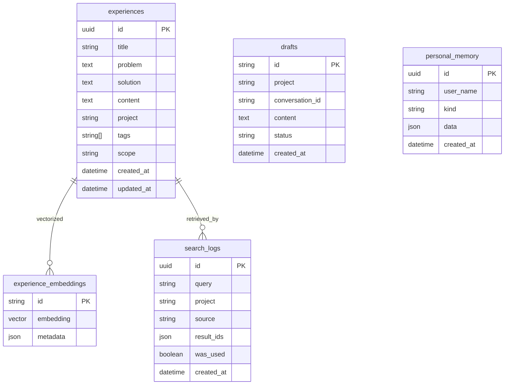
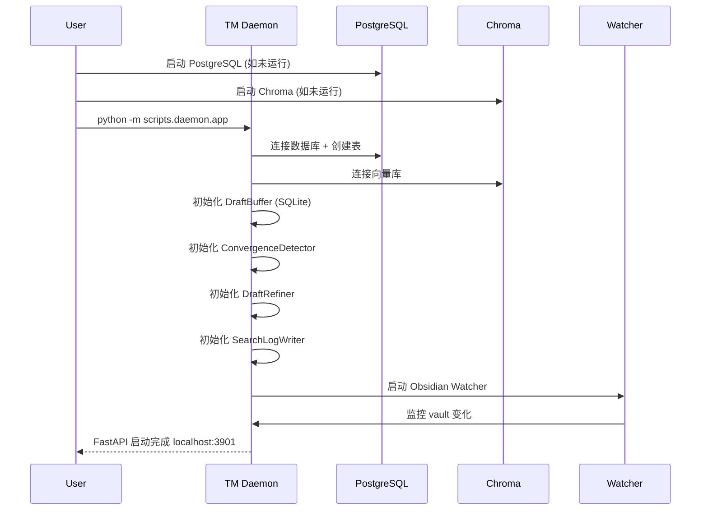

# TM Memory System v9 — 完整架构图

> 生成时间: 2026-04-26
> 覆盖: Hermes / Cursor / Claude Code 三端接入的记忆体系

---

## 1. 总体架构



---

## 2. 一次完整的对话循环



---

## 3. 检索流水线 (Search Pipeline)



---

## 4. 草稿管理流程



---

## 5. 三平台 Hook 对比

| 平台 | 配置文件 | Hook 类型 | 对应事件 | Hook 脚本 |
|------|---------|-----------|---------|-----------|
| **Hermes** | 无 (内置) | Python API | `on_turn_start` | `hermes_pipeline.py` |
| | | | `on_turn_end` | |
| **Cursor** | `~/.cursor/hooks.json` | 外部进程 | `sessionStart` | `cursor_session_start.py` |
| | | | `beforeSubmitPrompt` | `cursor_before_prompt.py` |
| | | | `afterAgentResponse` | `cursor_after_response.py` |
| **Claude Code** | `~/.claude/settings.json` | 外部进程 | `SessionStart` | `claude_session_start.py` |
| | | | `UserPromptSubmit` | `claude_user_prompt_submit.py` |
| | | | `Stop` | `claude_stop.py` |

### 通用 Hook 脚本 (`scripts/hooks/`)

```
hooks/
├── tm_hook.py              # CLI 工具: tm-hook session-start / before-prompt / after-response
├── hermes_pipeline.py      # Hermes 内置 pipeline (异步 HTTP 调用 Daemon)
├── cursor_session_start.py     # → POST /hooks/session_start
├── cursor_before_prompt.py     # → POST /hooks/before_prompt
├── cursor_after_response.py    # → POST /hooks/after_response
├── claude_session_start.py     # → POST /hooks/session_start
├── claude_user_prompt_submit.py# → POST /hooks/before_prompt
└── claude_stop.py              # → POST /hooks/after_response
```

---

## 6. 数据模型



---

## 7. 配置文件一览

```
├── ~/.claude/settings.json          # Claude Code hooks + model 配置
├── ~/.cursor/hooks.json             # Cursor hooks 配置
├── ~/.hermes/skills/tm-memory.md    # Hermes skill (自动加载)
├── ~/Work/agent/team_doc/
│   ├── scripts/daemon/app.py              # FastAPI 应用
│   ├── scripts/daemon/pipeline.py         # 业务流水线
│   ├── scripts/daemon/tm_sink.py          # 存储抽象层
│   ├── scripts/daemon/draft_buffer.py     # SQLite 草稿缓存
│   ├── scripts/daemon/search_log_writer.py # 搜索日志 + 评估
│   ├── scripts/daemon/convergence_detector.py
│   ├── scripts/daemon/draft_refiner.py
│   ├── scripts/daemon/markdown_indexer.py # Obsidian 文档索引
│   ├── scripts/daemon/watcher.py          # 文件监控
│   ├── scripts/hooks/                     # 三平台 hook 脚本
│   ├── src/team_memory/
│   │   ├── services/search_pipeline.py      # 检索引擎
│   │   ├── services/memory_operations.py  # CRUD 操作
│   │   ├── storage/repository.py          # SQL 仓库
│   │   ├── embedding/                     # Embedding 提供商
│   │   ├── reranker/                      # 重排序提供商
│   │   └── web/                           # Web API / MCP 端点
│   └── tests/                             # 测试集
├── ~/Obsidian/TeamMemory/           # Obsidian vault (标准化文档)
└── ~/Work/.../.claude/settings.json  # 项目级 Claude Code 配置
```

---

## 8. 评估指标

| 指标 | 说明 | 计算方式 |
|------|------|---------|
| `use_rate` | 检索结果被 Agent 引用的比例 | `was_used=True / 有结果的检索总数` |
| `hit_rate` | 检索命中率 (有无返回结果) | `有结果的检索总数 / 检索总数` |
| `query_top10` | 最常检索的问题 | `GROUP BY query ORDER BY count DESC` |

**CLI 查看:**
```bash
tm-hook stats          # 本周统计
tm-hook stats --days 3 # 近3天统计
```

---

## 9. 启动顺序



---

## 10. 关键设计决策

1. **为什么用 Daemon 而不是每个 Client 直接调 TM?**
   - 统一接口: 三个平台走同一套 pipeline
   - 状态管理: DraftBuffer 需要跨轮对话的状态
   - 性能: 检索引擎初始化成本高，不应每次 hook 都重新初始
   - 评估: SearchLog 需要单个位置统一写入

2. **为什么 Draft 用 SQLite 而非 PostgreSQL?**
   - 草稿是临时状态，不需要共享
   - SQLite 零配置，便于本地运行
   - 与 PostgreSQL 解耦，daemon 可独立启停

3. **为什么检索走向量+FTS Hybrid?**
   - 向量: 语义匹配 ("之前的问题" → 相关实体)
   - FTS: 关键词匹配 (crash / 上报 / 解决)
   - RRF 融合: 取两者之长

4. **为什么需要收敛检测，而不是每次都保存?**
   - 避免粒度过细: 单轮对话通常只是片段信息
   - 跨轮累积: 多轮后形成完整问题+解决方案
   - 自动发布: 减少用户手动操作
