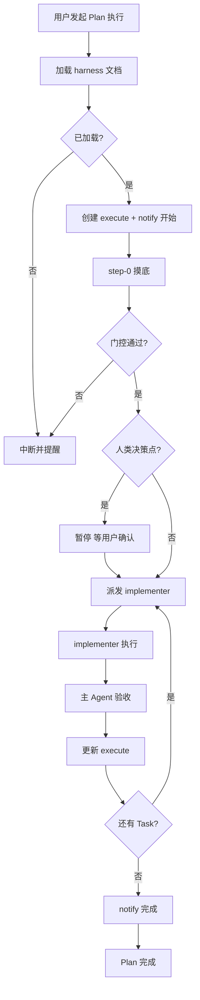

# Harness 规范（通用）

> 基于 OpenAI Harness Engineering，指导 LLM 在任何团队、项目中落地。纯 Harness，不依赖 tm 或特定 MCP。

---

## 一、核心原则

| 原则 | 说明 |
|------|------|
| **人类掌舵** | 目标、优先级、验收由人定；Agent 执行产出 |
| **Agent 执行** | 代码、文档、配置由 Agent 生成，人验收 |
| **尽量不手写** | 规则、工作流、MCP 驱动 |
| **先规划再执行** | 复杂任务先出计划，人确认后再做 |

---

## 二、知识库结构

| 轨道 | 路径 | 用途 |
|------|------|------|
| 设计 | `docs/design-docs/` | 架构、方案、决策 |
| 计划 | `docs/exec-plans/` | 执行计划、归档 |

- 新设计 → `docs/design-docs/`；计划完成 → `completed/`（详见 [doc-maintenance-guide](doc-maintenance-guide.md) 第六章）
- 主入口：`AGENTS.md` 作为目录（建议 ≤120 行，渐进披露）

---

## 三、Plan 执行流程

### 3.1 执行前（强制）

**必须加载**：本规范（HARNESS-SPEC）或项目等价的 harness 文档；**未加载则不得进入 step-0**。

进入 step-0 前，须在回复或首条日志中**显式列出**「已加载文档」，便于验证。

### 3.2 执行模式（Subagent-Driven）

| 模式 | 说明 |
|------|------|
| **Subagent-Driven** | 每个 Task 派发 implementer subagent；主 Agent 验收、更新 execute、派发下一 Task |
| 主 Agent 直接执行 | **禁止**，主 Agent 不得直接修改 Task 涉及的文件 |

**流程**：step-0 完成 → 派发 Task 1 implementer → 验收 → 派发 Task 2 → … → 全部完成 → **必须再跑 spec-reviewer** 对真实产出逐项核对。

**实现后评审**：Plan 全部 Task 完成后，必须派发 spec-reviewer；不得在实现尚未完成时执行。

### 3.3 执行记录

| 项目 | 约定 |
|------|------|
| 目录 | `docs/exec-plans/executing/{主题}/`（与 [plan-document-structure](plan-document-structure.md) 一致） |
| 命名 | `{plan-id}-execute.md` 或 `execute.md` |
| 一个 Plan 一个文件 | 中断后重启仍追加同一文件 |

**格式示例**：

```markdown
# Plan 执行记录：{Plan 名称}

> Plan ID: {plan-id} | 创建: {date} | 最后更新: {date}

## 执行摘要

| 字段 | 值 |
|------|-----|
| 状态 | 进行中 / 已中断 / 已完成 |
| 当前 Task | Task N |
| 最后节点 | {step 或 人类决策点} |

## 执行日志（按时间倒序，最新在上）

### {YYYY-MM-DD} — {节点摘要}

- **动作**：{做了什么}
- **产出**：{文件、结果}
- **下一步**：{待执行或需确认}
- **Subagent**：（Task 相关必填）task-N 派发 implementer / task-N 完成
- **通知**：（若调用）已调用 notify_plan_status.sh（{时机}）
```

**追加规则**：每次关键动作后追加；最新在上；调用 notify 须在同条日志记录。

**回复格式**（关键节点必须含）：

```
Plan 执行记录已更新：docs/exec-plans/executing/{主题}/{plan-id}-execute.md
- 状态：{进行中/已中断/已完成}
- 当前 Task：Task N
```

### 3.4 摸底（step-0）

- **定位**：Plan 的固定 step-0，进入 Task 1 之前执行
- **门控**：摸底通过（或产出可接受基线）才能进入 Task 1
- **示例**：架构类跑 import 检查；文档迁移类扫描路径；通用可简化为「确认 Plan 已加载、execute 已创建」

### 3.5 断点恢复

**触发**：用户说「继续」「从断点恢复」等，且 execute 存在且状态为「已中断」或「进行中」。

**步骤**：1) 加载 execute；2) 解析当前 Task、最后节点；3) 按需重载 harness 文档；4) step-0 基线未过期可跳过；5) 从下一 Task 继续；6) 新日志追加同一文件。

---

## 四、人类决策点

以下节点需人类确认后再继续：

| 节点 | 需确认内容 |
|------|------------|
| 摸底完成后 | 若产出需人工解读，是否继续 |
| Phase 完成 | 是否进入下一 Phase |
| 迁移前 | 迁移范围、目标路径 |
| 高影响变更 | 多模块、架构、破坏性变更 |

**实现**：主 Agent 暂停，回复写明「请确认：xxx，确认后回复“继续”」；更新 execute、调用 notify；收到肯定回复后再执行。

---

## 五、Task 自审清单

每个 Task 完成后自审：

| 项 | 通过标准 |
|----|----------|
| step-0 已执行 | 已产出基线或已确认 Plan 已加载 |
| execute 已更新 | 有对应日志条目 |
| 设计符合 Plan | 无遗漏、无多余 |
| 代码整洁 | 符合项目既有风格 |
| 测试覆盖 | 关键路径有测试 |
| 文档同步 | 无断裂引用 |
| 实现后 spec-reviewer | Plan 全部完成后必须跑，对真实产出逐项核对 |

---

## 六、反馈回路

**核心**：出错 → 定位根因 → 修复 → **更新 rules 或 docs** → 同类错误不再发生。

**沉淀方式**（纯 Harness，不依赖 MCP）：

| 方式 | 说明 |
|------|------|
| 更新 rules | `.cursor/rules/` 中新增或修改规则 |
| 更新 docs | `docs/design-docs/` 或 `docs/exec-plans/` 中记录 |

**沉淀内容**：根因、修复步骤、规则更新点；未追踪路径须将关键内容写入 solution/code_snippets。

**feedback-loop 结构**（若项目维护）：

- **上方**：待完善项
- **下方**：已完成（固化后移入，注明时间与位置）

---

## 七、系统通知

**时机**：Plan 开始、人类决策点、中断、Plan 完成。

**实现**：`scripts/notify_plan_status.sh "标题" "正文"`（best-effort，失败不中断 Plan）。

---

## 八、质量门禁

**概念**：提交前须通过 import 检查、代码规范、引用校验。项目可定义具体命令（见 extensions）。

**简单示例**：

```bash
ruff check src/
pytest tests/ -q
# 项目可增加：import 检查、harness_ref_verify 等
```

---

## 九、流程自检与中断

| 自检项 | 说明 |
|--------|------|
| step-0 已执行 | 摸底已完成 |
| Subagent-Driven 合规 | 每个 Task 通过 implementer 派发；主 Agent 不直接改 Task 文件 |
| 人类决策点已确认 | 收到用户肯定回复 |
| 质量门禁通过 | 涉及代码改动时 |
| execute 已更新 | 每次关键节点后 |

**不规范时**：停止执行 → 写入 execute 记录原因 → 回复提示 → notify 流程中断。

---

## 十、流程图

### 主流程



### 反馈回路


---

## 十一、扩展

项目强相关内容（架构分层、质量门禁命令、收尾清单、tm 叠加等）见 `project-extension.md` 或项目等价文档。
