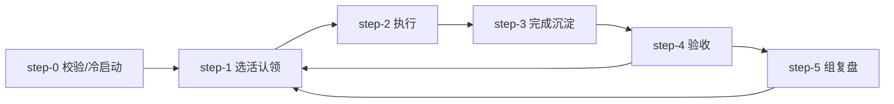
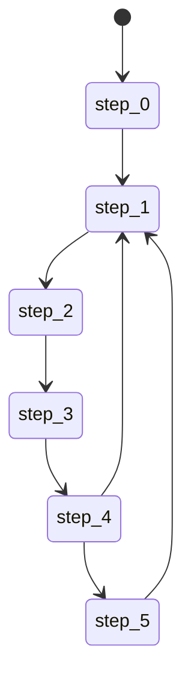

# 工作流写法可借鉴方案

> **【已过期】** 本文档已归档至 `docs/exec-plans/archive/`，后续工作流优化**不再参考**此文件内容。当前已确认采用 **YAML 单源**（`.tm_cursor/plans/workflows/*.yaml`），流程定义以 YAML 为准。
>
> 目标：让流程**更直观、可方便调节**。以下示例中的步骤编号已与当前 YAML 一致（step-4 = 验收，step-5 = 组复盘），仅作历史参考。

与 [task-execution-workflow.md](../completed/workflow-optimization/task-execution-workflow.md) 配套使用；YAML 定义见 `.tm_cursor/plans/workflows/task-execution-workflow.yaml`。

---

## 一、当前写法（基线）

- **格式**：单文件 Markdown，`### step-X 【标题】` + 动作 / 验收标准 / 打断点。
- **优点**：无需解析器、可版本管理、Agent 易读。
- **不足**：顺序与分支不一眼可见；调节流程要改多处文字；「下一步是谁」分散在各段描述里。

---

## 二、可借鉴的写法

### 1. Mermaid 流程图 + Markdown 双轨（推荐优先）

**思路**：在同一份 `.md` 里增加一个 Mermaid 代码块，用图表达 step 顺序与允许的下一步；正文保持现有「步骤定义」。

**优点**：
- **直观**：一眼看到 step-0 → step-1 → … → step-3 → step-4（验收）→ step-5（组复盘），以及「禁止 step-3 直接到 step-5 或 step-1」。
- **可调**：改图即改流程观感；Git 友好、AI 友好。
- **无引擎**：图只作说明，执行仍由 Agent 读下方步骤定义。

**示例**（放在流程定义文件开头或「运行机制」前）：



可在箭头上加标签，例如：`S3 -->|唯一允许| S4`，并在图中不画 S3→S5、S3→S1，以显式表达「禁止跳步」。

**落地**：在 `task-execution-workflow.md` 的「流程定义」前加一节「## 流程概览（Mermaid）」，贴上述图；调节流程时改图 + 同步改对应 step 的「下一步」文案。

---

### 2. 步骤表（表格化流程）

**思路**：用一张表描述所有步骤，列包含：步骤 ID、标题、下一步（允许的 step_id 列表）、是否打断点、验收标准摘要。步骤详情（动作、完整验收标准）仍用折叠或链接到下文。

**优点**：
- **易调**：改「下一步」只需改表格一格；顺序与分支集中在一处。
- **可机读**：若将来做「步骤预言」MCP，可直接解析表格或从表格生成状态机。

**示例**：

| 步骤 ID   | 标题           | 允许的下一步     | 打断点 | 验收标准摘要           |
|-----------|----------------|------------------|--------|------------------------|
| step-0    | 校验与冷启动   | step-1           | 否     | 描述完善、依赖已确认   |
| step-1    | 选活与认领     | step-2           | 是     | 已认领，状态 in_progress |
| step-2    | 执行与记录     | step-3           | 是     | 任务达可交付节点       |
| step-3    | 完成并沉淀     | **仅 step-4**    | 否     | completed + 沉淀存在   |
| step-4    | 验收 Agent     | step-5, step-1  | 否     | 验收通过/已汇报        |
| step-5    | 组级复盘       | step-1           | 否     | 组级经验已生成         |

**落地**：在流程定义顶部或附录加「步骤一览表」；在 step-3 的正文中写「下一步（强制）：仅 step-4」，与表一致。

---

### 3. YAML/JSON 流程定义（声明式）

**思路**：用 YAML 或 JSON 描述步骤列表，每步含 `id`、`name`、`next`（或 `allowed_next`）、`checkpoint`、`acceptance_summary`；可选 `action`、`acceptance_criteria` 长文本。Agent 或「步骤预言」MCP 读该文件；人类可读版用同一份 YAML 生成 Markdown 或由 Markdown 手写后同步。

**优点**：
- **易调**：改 `next` / `allowed_next` 即改流程；可做 schema 校验。
- **可工具化**：状态文件、步骤预言、Web 展示「当前 step 与验收」都可从同一 YAML 驱动。

**可借鉴**：Dagu（DAG + 链式）、Temporal DSL（Serverless Workflow YAML）、LetsFlow（scenario YAML）、Microsoft 声明式工作流（YAML 配置）。

**示例（仅结构）**：

```yaml
workflow: task-execution
steps:
  - id: step-0
    name: 校验与冷启动
    allowed_next: [step-1]
    checkpoint: false
  - id: step-3
    name: 完成并沉淀
    allowed_next: [step-4]     # 仅此一步，禁止 step-1/step-5
    checkpoint: false
  - id: step-4
    name: 验收 Agent
    allowed_next: [step-5, step-1]
    checkpoint: false
```

**落地**：若引入 YAML，建议与现有 `.md` 双轨一段时间：YAML 作为「单源」，由脚本或文档约定生成 `task-execution-workflow.md` 的步骤表或 Mermaid，避免两处不一致。

---

### 4. 状态机图（状态 + 迁移表）

**思路**：显式列出「状态 → 可迁移到的状态」表，或画状态机图（Mermaid stateDiagram）。适合强调「禁止哪些迁移」（如 step-3 不可直接到 step-5）。

**示例（Mermaid）**：



**落地**：与「Mermaid 流程图」二选一或同时存在；状态机更强调「合法迁移」，流程图更强调「顺序与分支」。

---

### 5. 清单式 + 强制下一步（在现有 Markdown 上微调）

**思路**：保持现有 step 列表，只在**需要约束的步骤**（如 step-3）中增加一条固定行：

- **下一步（强制）**：仅允许 step-4；禁止直接进入 step-1、step-5。

这样「可调节」体现在：调节流程时改步骤列表（增删 step）的同时改对应「下一步（强制）」；直观体现在用 Mermaid 或步骤表补一层「一览」。

**清单式结构**：每个步骤是一个三级标题 `### step-X 【标题】`，下面用**无序列表**逐条写固定字段（动作、验收标准、打断点），需要约束时再加一条「下一步（强制）」；步骤之间无表格、无图，纯 Markdown 列表。示例：

```markdown
## 流程定义

### step-2 【执行与记录】

- **动作**：按任务描述与验收标准执行开发；关键节点用 tm_message 留记录。
- **验收标准**：任务实际工作已按描述完成或达到可交付节点。
- **打断点**：是

### step-3 【完成并沉淀单经验】

- **动作**：调用 tm_task(action=update, status=completed, summary=...)；若返回 group_completed: true 则进入 step-4。
- **验收标准**：任务状态为 completed，且存在对应的沉淀经验。
- **打断点**：否
- **下一步（强制）**：仅允许 step-4；禁止直接进入 step-1、step-5。

### step-4 【任务完成后验收 Agent（必须）】

- **动作**：必须先启动验收 Agent 对当前任务结果验收，通过后才可进入 step-5 或 step-1。
- **验收标准**：验收 Agent 已启动且已产出结论（验收通过 / 或 bad case 已汇报待确认）。
- **打断点**：否
```

要点：**清单式** = 步骤用「标题 + 若干条列表项」罗列，每条用加粗标签（**动作**、**验收标准** 等）区分；**+ 强制下一步** = 在需要约束的步骤里多一条「**下一步（强制）**：…」。

**落地**：与建议清单第 1 条（step-3 后显式禁止跳步）一致，可采用方案 B（单独一行「下一步（强制）」）。

---

## 三、多维度优缺点分析

从 **AI 友好**、**人读友好**、**人编辑友好**、**易扩展**、**可增加临时步骤**、**支持 if/else 逻辑** 等角度对上述写法做对比，便于按需求选型。步骤编号已与当前 YAML 一致（step-4 = 验收，step-5 = 组复盘）。详细维度说明、总表对比、各写法优缺点及小结见原版；此处从略。

---

## 四、组合建议

| 需求           | 建议写法 |
|----------------|----------|
| 先快速变直观   | 在现有 `.md` 上加 **Mermaid 流程图** + **步骤一览表**（表格） |
| 希望改流程只改一两处 | **步骤表** 或 **YAML** 的 `allowed_next`，正文只写动作与验收细节 |
| 将来做步骤预言/Web 展示 | 引入 **YAML 流程定义** 作为单源，由工具生成 Markdown 或状态机 |
| 强调禁止跳步   | **状态机图** 或 步骤表中的「允许的下一步」列 + 正文「下一步（强制）」 |
| 需要工作流做 if/else（条件分支） | **步骤表**（条件→下一步列）、**YAML**（when/condition）、**Mermaid 流程图/状态机图**（分支与条件迁移）；基线/清单式用自然语言可写但难结构化解析 |

**最小改动**：在对应工作流说明 `.md` 中增加「流程概览」：一个 Mermaid 图 + 一张步骤表（含「允许的下一步」），并在 step-3 正文中写明「下一步（强制）：仅 step-4」。无需改执行协议或 Rules，即可更直观、调节时更有据可依。

---

## 五、参考

- [task-execution-workflow.yaml](../task-execution-workflow.yaml) — 任务执行流程定义（YAML 单源）；[task-execution-workflow.md](../task-execution-workflow.md) — YAML 设计思路与元信息；[task-execution-workflow-design.md](../../task-execution-workflow-design.md) — 设计说明与运行机制
- 外部：Mermaid flowchart/stateDiagram、Dagu YAML、Temporal DSL、LetsFlow scenario、Microsoft 声明式工作流（YAML）
