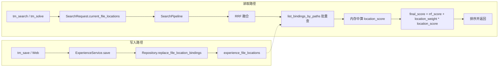

# 经验文件位置绑定 — 实现计划

> **For Claude:** 执行本计划时请使用 executing-plans 子技能，按任务逐步实现。
>
> **版本说明：** 本版已按多专家评审报告落实 Blockers（检索批量化、过期清理）、High Risks（量纲与得分、指纹单点、迁移回滚、Web 录入展示、TTL 可配置）、体验与价值（location_weight 说明与引导、Web 首版录入方式）、质量保障（得分与边界规则集中定义、指纹/重叠边界成文、E2E 必做与量化验收、可观测性）。

**目标：** 支持经验与文件位置（路径 + 行范围）绑定，采用内容指纹在编辑后稳定匹配；可配置 TTL（默认 30 天）并在访问时刷新；在检索中与向量/FTS 一致地使用 `location_weight` 融合位置得分。

**架构：** 新表 `experience_file_locations` 存储每条绑定：路径、行范围、内容指纹（归一化片段 hash）、绑定时的文件 mtime 与 content hash、expires_at、last_accessed_at。写入：Agent 在 `tm_save`/`tm_save_typed` 及 Web 创建/更新时传入可选 `file_locations`；服务层/仓储持久化绑定；**指纹与归一化仅由 utils 单点实现**，仓储/服务只调用不重算。读取：检索请求支持可选 `current_file_locations`；**禁止「每候选×每位置」逐次调用**，改为**按 current_file_locations 中的 path（及可选 fingerprint）批量查询绑定**，在**管道层内存**中为每条候选算 location_score，再与 RRF 得分加权。过期绑定通过**定时清理任务**物理删除，避免表膨胀。失效策略：mtime + content hash；仅对上述绑定做 TTL + 访问刷新。

**技术栈：** SQLAlchemy（async）、现有 SearchConfig/SearchPipeline、hashlib 做指纹、可选服务端按项目路径读文件。

**已锁定决策：**
- 关联方式：路径 + 行范围 + 即时校验 + TTL（方案 A）。
- 匹配方式：内容指纹 / 语义区域（方案 3）；文件变更后用指纹在当前内容中重新锚定。
- TTL：全局可配置默认 30 天；访问时刷新（方案 C）。仅适用于「与文件绑定的经验」；档案馆系统单独设计。
- 融合方式：新增 `location_weight`；final_score = rrf_score + location_weight * location_score（方式 1，与向量/FTS 一致）。
- 失效判定：mtime + content hash。
- `file_locations` 结构：允许可选字段（如 content_hash、snippet），见下文。

---

## 检索路径与得分约定（必读）

- **批量查询、禁止 N×M 调用**：管道层不得对「每个候选 experience_id × 每条 current_file_locations」逐次调用仓储。必须先根据 current_file_locations 收集所有 path（及可选 content_fingerprint），**一次或少量几次**调用仓储批量拉取这些 path 下的未过期绑定（新方法如 `list_bindings_by_paths(paths, ttl_days)` 返回 path -> list[binding]）；管道内遍历候选，在内存中根据绑定与 current_file_locations 做重叠/指纹匹配，算出每条候选的 location_score。
- **量纲与 location_weight**：RRF 融合后 `item.score`（rrf_score）量纲为 rank-based，典型数量级约 0.01～0.05（k=60 时）。location_score 定义为 **0 / 0.7 / 1.0** 三档（见下），与 RRF 相加时不做归一化；**location_weight 默认 0.15** 的取值理由：使一次「精确位置命中」的加分约相当于数档 RRF 排名提升，避免位置信号完全压倒语义，推荐区间 0.1～0.25，Plan 与配置 docstring 中写明「默认即可，一般无需调整」。
- **location_score 与边界规则（集中定义，全计划唯一引用）**：
  - **LOCATION_SCORE_EXACT = 1.0**：当前编辑范围与绑定行范围重叠，且（若提供）mtime/content_hash 一致或已用指纹在当前内容中重新锚定并重叠。
  - **LOCATION_SCORE_SAME_FILE = 0.7**：同 path 匹配但行范围不重叠，或仅 path 匹配（无 snippet/无 file_content 时仅按 path 视为同文件）。
  - **LOCATION_SCORE_NONE = 0.0**：该候选在此次 current_file_locations 中无任何绑定命中。
  - 同一候选被多条 current_file_locations 命中时，取**各位置得分最大值**作为该候选的 location_score（不累加）。
- **指纹与 window 单点**：归一化与指纹算法、`window_size`（默认 20）**仅**在 [src/team_memory/utils/location_fingerprint.py](src/team_memory/utils/location_fingerprint.py) 中实现；仓储层只调用 utils，不得重算指纹或使用不同 window/归一化，避免实现分叉导致「有指纹但检索不到」。

---

## 数据模型与配置

### 任务 1：TTL 与 location 权重的配置

**涉及文件：**
- 修改：[src/team_memory/config.py](src/team_memory/config.py)（SearchConfig 及必要时新增小配置块）
- 测试：已有 [tests/test_config.py](tests/test_config.py) 或现有配置测试

**步骤 1：** 在 `SearchConfig` 中增加 `location_weight: float = 0.15`（用于融合；docstring 写明：文件位置匹配在最终得分中的权重，推荐 0.1～0.25，默认即可一般无需调整）。在 Settings 下新增文件位置绑定配置块（如 `FileLocationBindingConfig`）：`file_location_ttl_days: int = 30`，`file_location_refresh_on_access: bool = True`，`file_location_cleanup_enabled: bool = True`，`file_location_cleanup_interval_hours: int = 24`（定时清理过期绑定的间隔）。在 docstring 中说明含义。

**步骤 2：** 增加测试：默认 `location_weight` 为 0.15、`file_location_ttl_days` 为 30、`file_location_cleanup_enabled` 为 True、`file_location_cleanup_interval_hours` 为 24。运行测试，确认在未实现时失败。

**步骤 3：** 在 config 中实现上述默认值。运行测试通过。

**步骤 4：** 提交：`feat(config): 增加 location_weight 与 file_location TTL/refresh 配置`

---

### 任务 2：experience_file_locations 模型与迁移

**涉及文件：**
- 修改：[src/team_memory/storage/models.py](src/team_memory/storage/models.py)
- 新建：`migrations/versions/<rev>_experience_file_locations.py`（Alembic 迁移）

**步骤 1：** 在 models.py 中定义 `ExperienceFileLocation`：`id`（UUID）、`experience_id`（FK experiences.id，CASCADE）、`path`（String，建索引）、`start_line`、`end_line`（Integer）、`content_fingerprint`（String，可空，建索引）、`snippet`（Text，可空）、`file_mtime_at_bind`（Float，可空）、`file_content_hash_at_bind`（String，可空）、`expires_at`（DateTime TZ）、`last_accessed_at`（DateTime TZ，可空）。索引：(experience_id, path)、(path, content_fingerprint)。在 `Experience` 上增加对 `file_locations` 的 relationship。

**步骤 2：** 生成迁移：`alembic revision -m "experience_file_locations"`。编辑 upgrade：创建表与索引；downgrade：按逆序删除索引与表。**迁移与回滚约定**：生产/预发执行顺序与现有迁移一致；大表场景下该表初始为空，无锁表风险；若需回滚，执行 `alembic downgrade -1` 使用 downgrade 删除表，文档中注明「回滚会删除 experience_file_locations 全表数据」。

**步骤 3：** 在开发库执行迁移，跑现有测试确保无回归。提交：`feat(storage): 增加 ExperienceFileLocation 模型与迁移`

---

### 任务 3：文件位置相关仓储方法

**涉及文件：**
- 修改：[src/team_memory/storage/repository.py](src/team_memory/storage/repository.py)
- 测试：[tests/test_repository.py](tests/test_repository.py) 或新建 [tests/test_repository_file_locations.py](tests/test_repository_file_locations.py)

**步骤 1：** 实现 `replace_file_location_bindings(session, experience_id, bindings: list[dict])`：每条 dict 含 path、start_line、end_line，可选 content_fingerprint、snippet、file_mtime_at_bind、file_content_hash_at_bind；expires_at、last_accessed_at 由配置计算。**content_fingerprint 必须由调用方传入**（服务层用 utils.content_fingerprint 计算），仓储不调用指纹算法。先删该经验下全部绑定再插入新列表。先写失败测试。

**步骤 2：** 实现 `get_file_location_bindings(experience_id) -> list[dict]`。实现 **`list_bindings_by_paths(session, paths: list[str], ttl_days: int) -> dict[str, list[dict]]`**：按 path 在 paths 列表中的未过期（expires_at > now）绑定批量查询，返回 path -> list[binding]，供管道层在内存中算 location_score。实现 **`find_experience_ids_by_location`**（单 path 单范围，供单测或非批量场景）：逻辑同上，返回 (experience_id, location_score)；**得分必须使用常量 LOCATION_SCORE_EXACT=1.0、LOCATION_SCORE_SAME_FILE=0.7**（与「检索路径与得分约定」一致）；无 snippet 且无 file_content 时仅按 path 匹配，给 LOCATION_SCORE_SAME_FILE。若 refresh_on_access，更新命中绑定的 last_accessed_at 与 expires_at。实现 **`delete_expired_file_location_bindings(session, batch_size: int = 500) -> int`**：删除 expires_at < now 的绑定，最多删除 batch_size 条，返回删除数，供定时任务调用。为 replace、list_bindings_by_paths、find、delete_expired 编写失败测试。

**步骤 3：** 实现 replace、get_file_location_bindings、list_bindings_by_paths、find_experience_ids_by_location、delete_expired_file_location_bindings；运行测试直至通过。提交：`feat(repository): 文件位置绑定的替换、批量查询与过期清理`

---

### 任务 4：指纹与重叠辅助函数

**涉及文件：**
- 新建：[src/team_memory/utils/location_fingerprint.py](src/team_memory/utils/location_fingerprint.py)
- 测试：[tests/test_location_fingerprint.py](tests/test_location_fingerprint.py)

**步骤 1：** 实现 `normalize_snippet_for_fingerprint(text: str) -> str`：strip、折叠空白；**空串或 None 返回 ""**。实现 `content_fingerprint(snippet: str) -> str`：归一化后 hash（如 sha256）；**空串返回固定常量（如 "empty"）**，与归一化约定一致。实现 `find_fingerprint_in_lines(lines: list[str], fingerprint: str, window_size: int = 20) -> tuple[int,int] | None`：在行上滑动窗口（**window_size 为全计划唯一默认值 20**），归一化后算指纹；**指纹未找到返回 None**；**lines 为空或 window 超出行数时返回 None**。实现 `lines_overlap(a_start, a_end, b_start, b_end) -> bool` 与 `overlap_score(...) -> float`（完全包含 1.0，部分重叠 0.7）。**导出常量 LOCATION_SCORE_EXACT = 1.0、LOCATION_SCORE_SAME_FILE = 0.7**，供仓储与管道引用。单测必须覆盖：空串/None 输入、window_size 边界、指纹未找到、重叠边界。

**步骤 2：** 实现并通过测试。提交：`feat(utils): 位置指纹与行重叠辅助`

---

## 写入路径：保存经验时附带 file_locations

### 任务 5：Experience 服务 save() 接受 file_locations

**涉及文件：**
- 修改：[src/team_memory/services/experience.py](src/team_memory/services/experience.py)
- 测试：[tests/test_service.py](tests/test_service.py)

**步骤 1：** 为 `save()` 增加参数 `file_locations: list[dict] | None = None`。每条 dict：必填 `path`，可选 `start_line`、`end_line`、`snippet`、`file_mtime`、`file_content_hash`。创建经验后，若有 file_locations 则**仅使用 utils.location_fingerprint.content_fingerprint(normalize_snippet_for_fingerprint(snippet))** 计算 content_fingerprint（无 snippet 则不填），再调用 repo.replace_file_location_bindings，expires_at = now + 配置的 ttl_days。编写失败测试：带 file_locations 保存后查询绑定，断言条数与 path。

**步骤 2：** 实现并跑通测试。提交：`feat(experience): 保存时支持 file_locations 与 TTL`

---

### 任务 6：MCP tm_save / tm_save_typed 接受 file_locations

**涉及文件：**
- 修改：[src/team_memory/server.py](src/team_memory/server.py)

**步骤 1：** 为 `tm_save`、`tm_save_typed` 增加可选参数 `file_locations: list[dict] | None = None`，透传到 service.save()。在工具描述中说明：每项可含 path、start_line、end_line，可选 snippet、file_mtime、file_content_hash。

**步骤 2：** 跑现有 tm_save/tm_save_typed 测试；新增一次传入 file_locations 并断言绑定存在的测试。提交：`feat(mcp): tm_save / tm_save_typed 支持 file_locations`

---

### 任务 7：Web API 与 schema 中的 file_locations

**涉及文件：**
- 修改：[src/team_memory/web/app.py](src/team_memory/web/app.py)（ExperienceCreate、ExperienceUpdate 请求体）
- 修改：[src/team_memory/web/routes/experiences.py](src/team_memory/web/routes/experiences.py)（创建/更新传入 file_locations；GET 详情用 repo.get_file_location_bindings 返回 file_locations）
- 修改：[src/team_memory/web/static/index.html](src/team_memory/web/static/index.html)、[src/team_memory/web/static/js/components.js](src/team_memory/web/static/js/components.js)（录入与展示）

**步骤 1：** 在 ExperienceCreate、ExperienceUpdate 中增加 `file_locations: list[dict] | None = None`。在 create_experience、update_experience 中传给 service.save/update。在 get_experience 详情中加载绑定并加入响应 `file_locations`。

**Web UI 约定（录入与展示）**：**录入**：创建/编辑经验页增加「文件位置（可选）」区域；每行一条，格式为 `path` 或 `path:start_line` 或 `path:start_line-end_line`（与现有 git_refs/related_links 类似的 textarea 多行）；首版不实现「从当前文件/选区带出」，仅支持手动输入，便于与 MCP 的 file_locations 一致。**展示**：详情页在正文区域下方或元数据区展示「关联位置」只读列表，每条显示 path 与行范围（若有），可复制；不要求可点击跳转（后续可加）。编写或扩展 Web 测试（创建时带 file_locations）。提交：`feat(web): 经验创建/更新与详情中的 file_locations`

---

## 读取路径：带 current_file_locations 与 location_weight 的检索

### 任务 8：SearchRequest 与管道中的 location 得分（批量 + 内存）

**涉及文件：**
- 修改：[src/team_memory/services/search_pipeline.py](src/team_memory/services/search_pipeline.py)
- 修改：[src/team_memory/services/experience.py](src/team_memory/services/experience.py)（search() 传入 current_file_locations）
- 修改：[src/team_memory/server.py](src/team_memory/server.py)（tm_search、tm_solve 传入 current_file_locations）

**步骤 1：** 在 `SearchRequest` 中增加 `current_file_locations: list[dict] | None = None`。每项：path、start_line、end_line，可选 file_content、file_mtime、file_content_hash。从 SearchConfig 读取 `location_weight`。

**管道步骤（禁止 N×M 调用）**：若无 current_file_locations 或为空，跳过 location 步。否则：(1) 从 current_file_locations 收集所有 path；(2) **一次**调用 `repo.list_bindings_by_paths(session, paths, ttl_days)` 得到 path -> list[binding]；(3) 在**内存**中遍历当前 RRF 候选列表，对每条候选 experience_id，根据其是否出现在上述绑定的 experience_id 集合中，结合 current_file_locations 与绑定行范围/指纹（调用 utils.find_fingerprint_in_lines、overlap_score），按「检索路径与得分约定」计算该候选的 location_score（使用 LOCATION_SCORE_EXACT / LOCATION_SCORE_SAME_FILE）；同一候选多位置取**最大值**；(4) final_score = item.score + location_weight * location_score；按 final_score 重排；(5) 若有 refresh_on_access，对本次命中且需刷新的绑定在仓储层批量更新 last_accessed_at 与 expires_at（可在 list 返回后由管道触发一次批量刷新，避免在循环内写库）。将 item.score 保持为 RRF 得分，在 item.data 中写入 location_score 便于调试。

**可观测性**：在管道内对该步骤打日志或指标：current_file_locations 数量、批量查询返回的绑定数、参与 location 加分的候选数、本步耗时；若调用 list_bindings_by_paths 或后续刷新失败，记录错误并降级为 location_score=0。

编写失败测试：mock list_bindings_by_paths 返回某 experience_id 的绑定，断言该候选 location_score 与 final_score 抬升。提交：`feat(search): 管道中 location_weight 与 current_file_locations（批量+内存）`

---

### 任务 9：tm_search、tm_solve 传入 current_file_locations

**涉及文件：**
- 修改：[src/team_memory/server.py](src/team_memory/server.py)

**步骤 1：** 为 `tm_search` 增加可选参数 `current_file_locations: list[dict] | None = None`（path、start_line、end_line，可选 file_content、file_mtime、file_content_hash）。`tm_solve` 同样增加并传入。在构建 SearchRequest 时带上 current_file_locations。更新工具描述。提交：`feat(mcp): tm_search / tm_solve 传入 current_file_locations`

---

### 任务 10：配置 API 与 Web 设置（location_weight + TTL + refresh + 清理）

**涉及文件：**
- 修改：[src/team_memory/web/app.py](src/team_memory/web/app.py)（检索配置与文件位置绑定配置的响应/请求模型）
- 修改：[src/team_memory/web/routes/config.py](src/team_memory/web/routes/config.py)（若存在检索/配置保存路由）
- 修改：[src/team_memory/web/static/index.html](src/team_memory/web/static/index.html)（设置面板）
- 修改：[src/team_memory/web/static/js/pages.js](src/team_memory/web/static/js/pages.js)（加载/保存）

**步骤 1：** 在检索配置 GET/POST 及 app 中 SearchConfig 里加入 **location_weight**。在设置中增加 location_weight 输入，**说明文案**：「文件位置匹配在检索得分中的权重。推荐 0.1～0.25，默认 0.15 即可，一般无需调整。」提供 placeholder 或 hint「默认即可」。将 **file_location_ttl_days**、**file_location_refresh_on_access**、**file_location_cleanup_enabled**、**file_location_cleanup_interval_hours** 纳入配置 API 与 Web 设置（与 location_weight 同区或单独「文件位置绑定」小卡片），便于生产按环境调整 TTL 或关闭访问刷新/清理。与现有检索配置一并加载与保存。提交：`feat(web): 设置项 location_weight 与 file_location TTL/refresh/cleanup`

---

## TTL、访问刷新与过期清理

### 任务 11：查找路径中的过期与刷新

**涉及文件：**
- 修改：[src/team_memory/storage/repository.py](src/team_memory/storage/repository.py)

**步骤 1：** 在 list_bindings_by_paths 与 find_experience_ids_by_location 中仅保留 expires_at > now 的绑定。当返回某条命中且 refresh_on_access 为 True 时，更新该绑定的 last_accessed_at = now、expires_at = now + ttl_days（ttl_days 从配置/服务传入）。仓储方法签名中接受 ttl_days、refresh_on_access。增加测试：创建已过期绑定，断言不会被返回；创建未过期绑定，用 refresh_on_access=True 调用 find，断言 expires_at 被延后。提交：`feat(repository): 文件位置 TTL 过滤与访问刷新`

---

### 任务 11b：过期绑定定时清理与可观测性

**涉及文件：**
- 新建或修改：启动/定时入口（如 [src/team_memory/bootstrap.py](src/team_memory/bootstrap.py) 或独立脚本/后台任务）
- 修改：[src/team_memory/config.py](src/team_memory/config.py)（已有 file_location_cleanup_enabled、file_location_cleanup_interval_hours）

**步骤 1：** 实现定时清理：当 `file_location_cleanup_enabled` 为 True 时，按 `file_location_cleanup_interval_hours` 周期调用 `repo.delete_expired_file_location_bindings(session, batch_size=500)`，直到返回 0 或单轮删除数 < batch_size。可通过现有后台任务框架、独立 cron 或 Web 健康检查旁路触发（具体与项目现有运维方式一致）。**可观测性**：清理轮次打日志（删除条数、耗时）；检索路径中 list_bindings_by_paths 与刷新步骤的调用量/延迟/失败在任务 8 已约定。提交：`feat(ops): 文件位置过期绑定定时清理与日志`

---

## 文档与集成

### 任务 12：文档与规范

**涉及文件：**
- 新建或修改：[docs/design-docs/experience-file-line-binding-and-expiration.md](docs/design-docs/experience-file-line-binding-and-expiration.md)
- 修改：[README.md](README.md) 或 [docs/GETTING-STARTED.md](docs/GETTING-STARTED.md)（一句说明 file_locations）
- 修改：[docs/mcp-patterns.md](docs/mcp-patterns.md) 或工具列表：说明 tm_save/tm_save_typed 的 file_locations、tm_search/tm_solve 的 current_file_locations

**步骤 1：** 在设计文档中增加「实现：内容指纹与 location_weight」小节并引用本计划；写明 file_locations、current_file_locations 的字段（path、start_line、end_line，可选 snippet、file_mtime、file_content_hash）。在 MCP 工具列表中补充上述参数。补充「过期绑定清理」策略与配置项（cleanup_enabled、interval_hours）、以及检索路径可观测性（批量查询与 location 步骤的日志/指标）。提交：`docs: 文件位置绑定、MCP 参数与清理/可观测性`

---

### 任务 13：端到端与 lint（E2E 必做 + 量化验收）

**步骤 1：** 执行 `make lint` 并修复新问题。执行 `make test` 并修复失败。

**步骤 2：** **必做 E2E**：增加一条端到端测试（或集成测试），验收标准如下（量化断言）：(1) 保存一条经验并传入 file_locations（至少含 path、start_line、end_line，可选 snippet）；(2) 使用与绑定**相同 path 且行范围重叠**的 current_file_locations 调用检索；(3) 断言该经验出现在结果集中且 **location_score >= LOCATION_SCORE_EXACT（1.0）**；(4) 断言该条在「有 location 加分」时的**最终得分**高于「同一查询但不传 current_file_locations」时该条的得分。可选：再测「仅 path 一致、行范围不重叠」时 location_score 为 LOCATION_SCORE_SAME_FILE（0.7）。提交：`chore: 文件位置绑定相关 lint 与 E2E 验收`

---

## 概念示意

---

## 本计划不包含

- 档案馆 / 长期记忆系统（单独设计）。
- 按绑定粒度的 TTL 覆盖（仅全局 TTL + 刷新）。
- 语义区域（AST/函数边界）；仅做片段内容指纹。
- 服务端从工作区读文件（客户端可传 file_content；若配置了项目路径，服务端读盘可后续加）。
- Web 端「从当前文件/选区带出」path 与行范围（首版仅支持手动输入，与 MCP 对称）。
