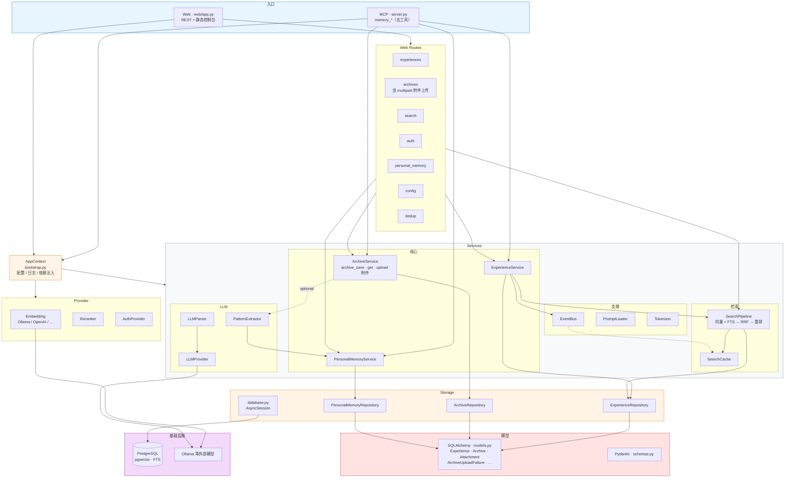
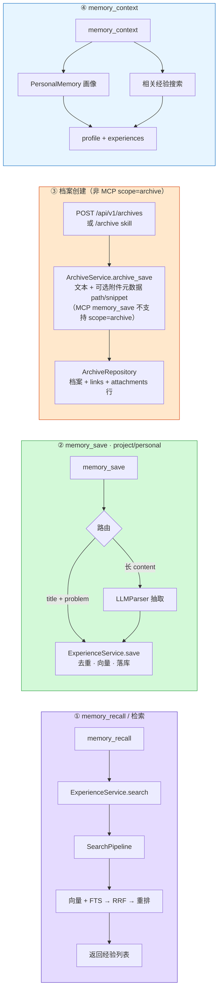
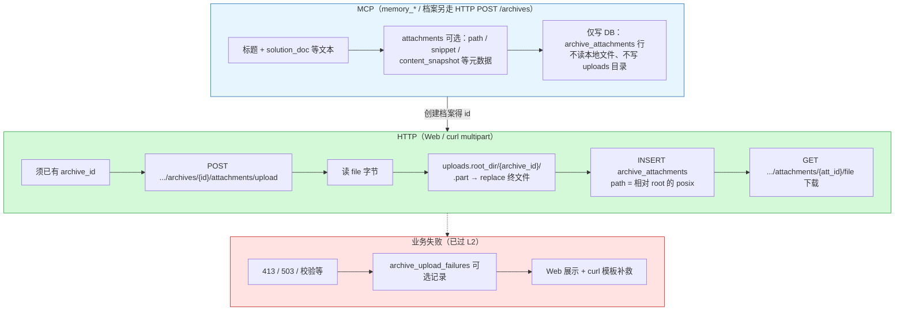
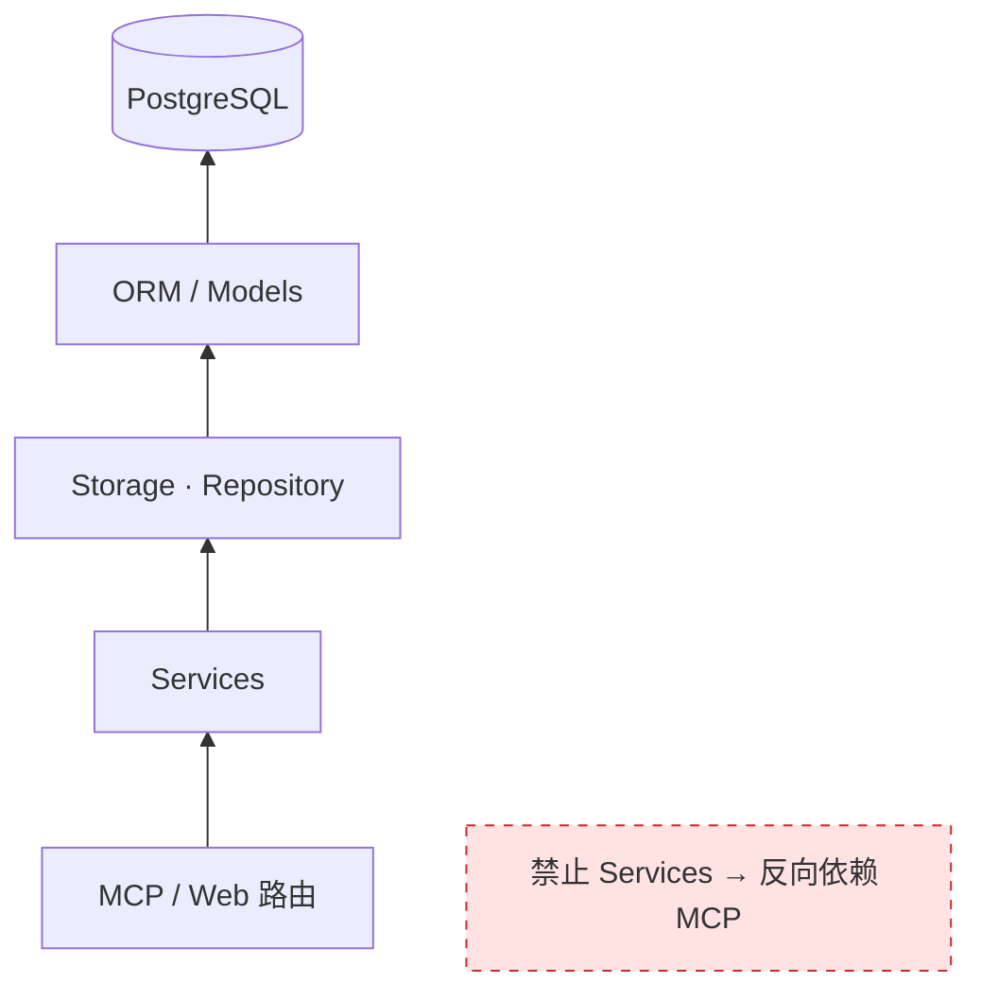

# Team Memory 架构设计图

> **配套说明**：L0～L3 以 [AGENTS.md](../AGENTS.md) 与 `scripts/harness_import_check.py` 为准；MCP 仅 **`memory_*`** 五工具，见 [README.md](../README.md) 与 [src/team_memory/server.py](../src/team_memory/server.py)。

本文档用 **Mermaid** 描述仓库分层与数据流。可在以下环境 **直接看图**：

| 环境 | 说明 |
|------|------|
| **GitHub / GitLab** | 打开本 Markdown 文件，内置 Mermaid 渲染 |
| **VS Code** | 安装「Markdown Preview Mermaid Support」等扩展后预览 |
| **Cursor** | Markdown 预览（若需插件，同上） |
| **浏览器** | 复制某段 ` ```mermaid ` 代码到 [mermaid.live](https://mermaid.live) |

---

## 1. 系统总览（入口 → 服务 → 存储）



---

## 2. 核心数据流（四条路径）



---

## 3. 档案馆：MCP 文本 vs HTTP 附件落盘



---

## 4. 依赖方向（约束）



---

## 修订说明

- 历史版本中 Mermaid 与说明混在一个未标注 `mermaid` 的代码块内，预览器无法渲染；现已拆块并统一为 **` ```mermaid `** 围栏。
- 补充 **档案馆 multipart 上传** 与 **MCP 仅元数据** 的对照，与 `docs/exec-plans/completed/archive-file-upload-mvp/1-plan/plan.md` 及当前实现一致。
- **③ 数据流**：`memory_save(scope=archive)` 已移除；档案创建走 HTTP `/api/v1/archives`（或 skill），与 `server.py` / README 说明一致。
